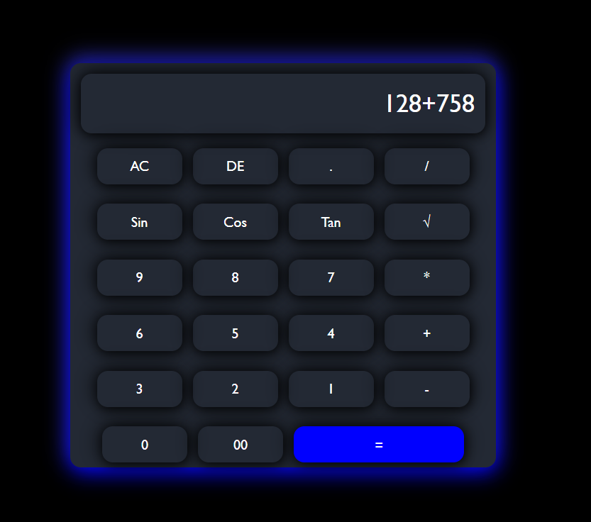

# Calculator Project

A simple scientific calculator built using HTML, CSS, and JavaScript.

## Features
- Basic operations (+, -, *, /)
- Trigonometric functions (sin, cos, tan)
- Square root
- Clean UI with responsive design

## Tech Stack
- HTML
- CSS
- JavaScript

## How to Run
1. Download or clone the repo
2. Open index.html in browser

## Future Improvements
- Add log and power functions
- Add keyboard support
- Improve UI design

